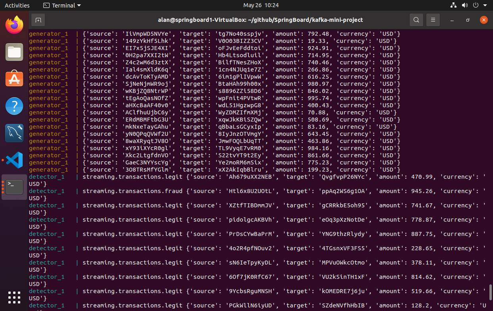

# Kafka Mini Project

## This is a simple example of kafka stream processing.  An input stream of transactions between 0 and 1000 dollars is separated into two output streams: streaming.transactions.legit (amount < 900) and streaming.transactions.fraud (amount >= 900).

## Usage:

 

## First, launch zookeeper and kafka docker images.

 

 

## Next, launch client apps. Generator app produces randomized transactions.  Detector separates transaction stream into legit and fraud output streams.

 

 

## View debug output from generator and detector.

 

 

## Use kafka-console-conmsumer to observe legit stream.

 

 

## Use kafka-console-consumer to observe fraud stream.

 

